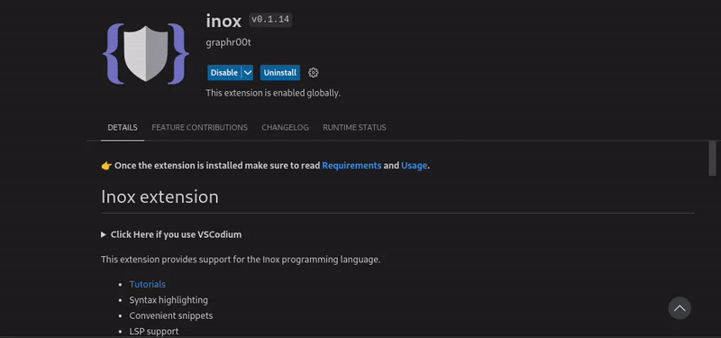
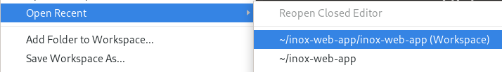
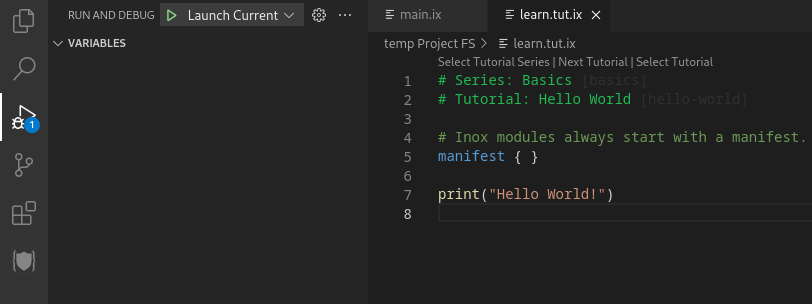
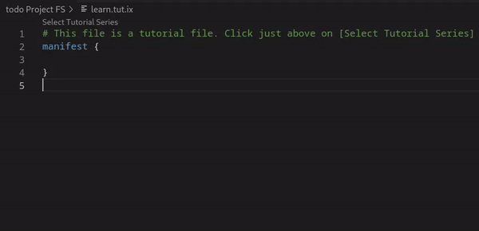
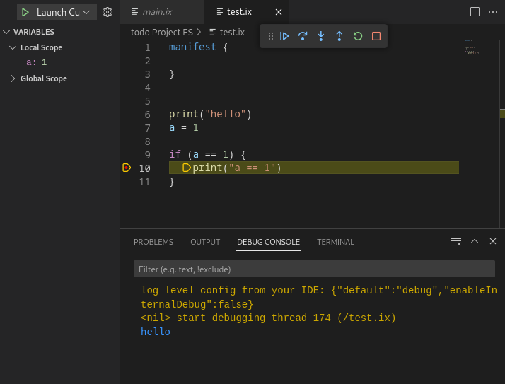

**👉 Once the extension is installed make sure to read [Requirements](#requirements) and [Usage](#usage).**

# Inox extension

**
Click Here if you use VSCodium
**

Go on https://marketplace.visualstudio.com/items?itemName=graphr00t.inox and click on `Download Extension` to download the VSIX file for the extension:\

You can install the extension in VSCodium by going on the **Extensions**
tab and clicking here:\

This extension provides support for the Inox programming language.

- [Tutorials](#tutorials)
- Syntax highlighting
- Convenient snippets
- LSP support
  - Error diagnostics
  - Hover information
  - Completions
  - Formatting
- [Debugging](#debugging)

## Requirements

This extension should work on **all platforms**. It requires a project server to be listening on `wss://localhost:8305`. This server can only run on Linux for now.

__A) You have a local machine or VM running Linux__

You can either install the [inoxd daemon](https://github.com/inoxlang/inox/blob/master/docs/inox-daemon.md) to start the project server automatically __(recommended)__ or start it manually with the following command: `inox project-server &`.

_If you have installed inoxd inside a VM don't forget to forward the port 8305._

__B) You have a remote machine running Linux (e.g VPS)__

- Install the [inoxd daemon](https://github.com/inoxlang/inox/blob/master/docs/inox-daemon.md) to start the project server automatically.
- update the **Websocket Endpoint** setting to the following value: `wss://<server-ip>:8305`

**
How to change an extension setting.
**

## Usage

**Creating a project**

- Create a folder (example: `inox-web-app`)
- Open the folder in a **new VSCode window**
- Execute the VSCode command `Inox: Create New Project in Current Folder`

👉 If you created the project server **after** having opened the folder you can use the command `Developer: Reload Window` to restart the LSP client.

**Opening a project**

- The first time open the `xxx.code-workspace` file and click on the floating button '**Open Workspace**'
- Subsequent times you can directly go in **File** > **Open Recent**:

  

**😡 Having an issue ? You are welcome to join the [Inox Discord Server](https://discord.gg/53YGx8GzgE) and ask for help.**

**Running a Program**

- Click on the same icon as in the screenshot.
- Select the `Launch Current Program` task, the other task always executes `/main.ix`.
- Click on the green arrow.

Learn about debug actions: https://code.visualstudio.com/Docs/editor/debugging#_debug-actions.

## Tutorials

Create a file named `learn.tut.ix` inside an Inox project and follow the instructions. Happy learning :).

## Debugging

